# touch-keyboard-proto

Web app to configure and test prototype touchscreen keyboards with variable gestures and layouts.

# Justification

When typing in languages with non latin script characters on touch screen devices, there is a growing number of options that break away from the classic keyboard of touch/button keys that is a direct virtual representation of a physical keyboard with layouts like QWERTY.

Extensions that modify or replace the OS touch screen keyboard must be written in a language native to that platform. Higher abstractions like React native don’t have that level of access. \
However, making a multi platform prototype as a web (or local app) is worthwhile, since the advantage of being accessible for testing to more people can outweigh its limited scope to be strictly within that app. \
This multi platform and isolated prototype is customizable for easy testing of different layouts. \
Then, in theory, functional touch keyboard designs can be implemented as native OS keyboard apps separately.

# Default keyboards

## `eng-frthen`

<b>frthen preview</b>

  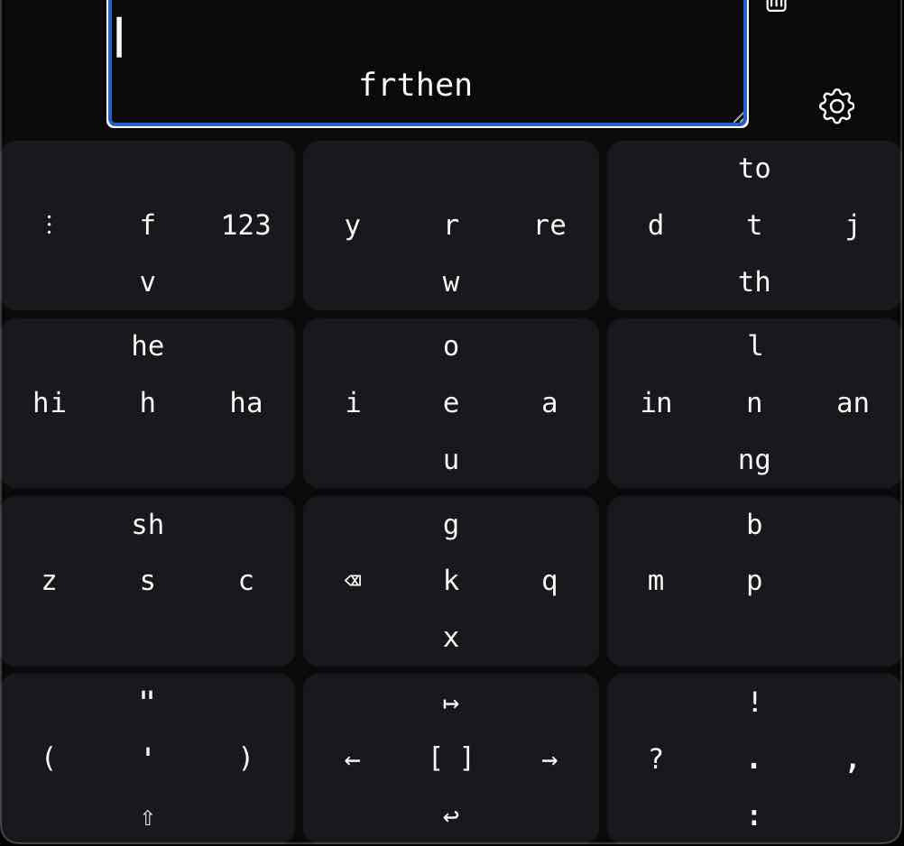

Among vowels, E is most common, so it’s center of vowels key with other English vowels at the 4 cardinal swipes. The vowels key is also at the center of the 9 letter keys, arranged in a 3x3 grid.

Consonants grouped by similarity of sound and relative frequency[^1]. Relative frequency in  `<`angle brackets`>`. X and C are arguable, so I have them in both, and underlined. I grouped R,W,Y because they are pseudo vowels.

[^1]: I don't currently know from where I derived the character or bigram relative frequencies.

| SOFT | HARD | 
| --- | --- |
| `m` <.02> | `b` `p` <.03> |
| `l` <.04> | `d` `t` `j` <.05> |
| `n` <.07> | `g` `k` `q` `x` `c` <.01> |
| `s` `z` `x` `c` <.02> |  |
| `f` `v` <.02> |  |
| `h` <.06> |  |
| `r` `w` `y` <.03> | |

Where there was extra space (ex. below t, th) I added a some bigrams (letter pairs). Top 10 by relative frequency[^1]:

- th = .039
- he = .037
- in = .023
- er = .022
- an = .021
- re = .018
- nd = .016
- ha = .012
- to = .012
- hi = .011
- ng = .011
- sh = ?   

Whitespace and punctuation adds a bottom row; all numbers and other symbols would be in a separate view.

Touch and hold or swipe and hold provide more options, as was done for diacritics embed keyboards (áüçêñÿ).

In addition to hold, a return swipe (ex from center to right, then return to center) is a separate gesture, as used in [딩굴](https://namu.wiki/w/%EB%94%A9%EA%B5%B4%20%ED%82%A4%EB%B3%B4%EB%93%9C). Similar idea to swipe hold. For punctuation maybe ('→"), (-→=), (.→…), (,→;), (?→¿), (!→¡). For vowel pairs (e→ie). Currently used for (r→er), close `digits1key` embed keyboard, and various arithmetic operators in `digits1key`.

A long/ over return swipe, which goes beyond center on return. (a→ai), (o→ou).

An turn/ corner swipe could be used, similar to diagonal, but yielding 2 options for each corner. Q down = qu, g c up = ck, s c up = ch, m up = mb, l up = ld, nd left = nt. For vowel diphthongs also.

## `digits1key`

<b>digits1key preview</b>

  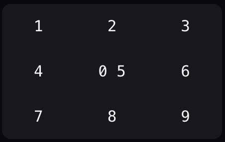

Available as an embedded 1-key keyboard within `eng-frthen`, on swipe-right-hold of the `f` key. Each outer digit is a swipe, `0` is touch, `5` is hold. 

Return swipes are used for arithmetic operators, like right-return for `+` and left-return for `-`.

Down-return closes the embed keyboard.

## `eng-qwerty`

<b>eng-qwerty preview</b>

  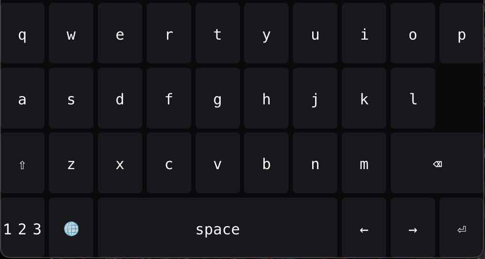

English QWERTY keyboard based on common existing touch screen keyboards. \
All digits and symbols are in separate child keyboards (other implementations would add a top row of digits). \
Inludes diacritics on hold.

It also showcases bridge keys (whose dimensions are greater than 1x1) and gaps.

Missing key strokes and labels are pending in [#37](https://github.com/ogallagher/touch-keyboard-proto/issues/37).

# Use/evaluate/test keyboards

The default view is for `eval` mode, presenting a composer text box above and the current active keyboard below.

The keyboard will only write when the composer is selected/focused. It auto focuses on page load, and when returning to `eval` mode.

Perform [gestures](#gestures) on the keys to view keystrokes in the composer.

## Switch keyboard

There is no dedicated UI control to switch to a different keyboard. However, one of the available keystrokes is to switch keyboards (`<switch-keyb>`). In [eng-frthen](#eng-frthen), for example, left swipe on the `f` key is mapped to the switch keyboard keystroke.

## Typing test integration

This is pending in [#47](https://github.com/ogallagher/touch-keyboard-proto/issues/47).

# Edit/configure keyboards

In `eval` mode, to the right of the composer is a button with **gear** icon to switch to `config` mode. Press it again to return to `eval` mode.

When editing, be aware that there is **no undo** feature!

## Edit key

In `config` mode, switch to the key section (square button at the top).

To edit a key, perform a gesture on one of the keys in the active keyboard below (ex. touch, swipe).

### Current gesture

The gesture is illustrated by a pair of [gesture icons](#gestures). 

The first is the **start segment**, and the second is the **full gesture**. If the gesture is a simple touch or swipe, these will be identical. More complex gestures like return swipes and corner swipes will be shown in the **full gesture**.

The [key label](#key-label) can depend on the current gesture start segment. \
For example, the [`digits1key`](#digits1key) center is labeled as `0 5` at rest, because touch keystroke is `0`, and hold is `5`. However, down return swipe maps to close keyboard (`<close-kb>`), so during a down swipe, the center is labeled as `ABC` to indicate that returning to the center will close child `digits1key` and return to the parent alphabet key.

The accompanying checkbox toggles whether we are specifying labels only for the current start segment.

### Key bounds

Press the key bounds button (square with a circle on each corner) to open **`-`/`+`** buttons at the 4 edges. \
The button pairs above and left move the current key. \
The button pairs below and right change the dimensions (width and height) of the current key.

### Add and remove key

The button that is either a minus or a plus in a square is to add or remove the current key (cell).

### Current modifier keys

The current modifier keys are indicated and selected with radio buttons and check boxes here. 

The [key label](#key-label) can depend on the current set of pressed/active modifier keys. \
For example, a key right label `re` can show `Re` during `<shift>`, and `RE` during `<caps-lock>`.

The accompanying check box toggles whether we are specifying labels only for the current modifer keys.

### Key label

A key label is split into 6 zones (up left, up, up right, left, center, right, down left, down, down right). \
Each can be set with a corresponding text box here.

See [current gesture](#current-gesture) and [current modifier keys](#current-modifier-keys) for setting label zones dependent on each.

### Keystroke

A key gesture's keystroke can be either a sequence of characters (and meta characters), or a child keyboard.

Switch between them with the pointer and keyboard icon buttons at the left.

Unlike [key label](#key-label), the modifer keys (shift, caps-lock) are currently automatically applied to keystroke characters.

#### Keystroke characters

Labeled **keystroke** is the text box for typing keystroke characters. Meta characters (ex. modifiers, cursor moves, switch keyboard, close keyboard) can be added with corresponding buttons beside the text box. The keystroke can be a combination of characters and meta characters.

#### Keystroke child keyboard

Labeled **child keyboard** is a text box showing the parent name + child name of the selected child keyboard.

Below is the list of available session keyboards, both parents and children. Select an item from this list as the child keyboard.

When a keyboard is adopted as a keystroke, which was not already a child of this keyboard, a clone of the keyboard to adopt is created, so that **editing the new child does not change the original**.

Child keyboards can also open nested child keyboards in the same way. When doing so, avoid creating cycles (ex. where a keyboard is a child of its own child). They appear to work, but may cause problems. In such cases, a close-keyboard or switch-keyboard keystroke is probably best.

Right of the child keyboard selection is the control for **size**: whether it is embedded within the parent key, or fills the entire key grid.

Next controls **persistence**: whether the child keyboard will close on any keystroke, or remain open until a `<close-kb>` stroke happens.

Next is a (arrow diagonal out of box) button to open and configure the child keyboard. In this case it is always shown as if it were `size=fill`. To see it as `size=embed`, switch back from `config` to `eval` mode.

Last is a (`X` in circle) button to unset the child keyboard.

## Edit keyboards

In `config` mode, switch to the keyboards section (grid button at the top).

### Session keyboards

There are three buttons here, for managing the list of keyboards in the session, importing keyboards from files, and exporting keyboards as files or share links.

#### Manage session keyboards list

Press the list button to show this control.

Below is a list keyboards by name. \
The checkbox controls whether the keyboard is included in [export](#export-keyboards-as-files-and-links). \
The minus button at the end of each row deletes the keyboard. \
The plus button at the end of the list adds a new empty single key keyboard.

Currently there is no dedicated control to switch keyboards (do so with switch keyboard keystroke), but if it is added, it will likely be here.

#### Import keyboards from files

Use this arrow into box button to import `json` files containing one or many keyboards.

#### Export keyboards as files and links

These are ways to save and share keyboards.

Press the arrow out of box button to open export buttons below. In both cases, the keyboards to include in export are [selected in the session keyboards list](#manage-session-keyboards-list). 

The first downloads keyboards as a `json` file.

The second creates a share link with the keyboards embedded in the url search params.

### Keyboard dimensions

Next to the large 3x3 grid icon are two pairs of **`-`/`+`** buttons. Use these to add and remove columns and rows.

### Keyboard viewport height

Adjust the range slider labeled **viewport height** to change the height of the keyboard without changing the row count.

### Keyboard name

Edit the text input labeled **name** to customize the name of the active keyboard.

## Site settings

In `config` mode, switch to the site section (gear button at top, currently grouped with keyboards section).

### Toggle gesture overlay canvas

By default, an overlay canvas is enabled to draw the gesture line segments ontop of the keyboard. This can be disabled by pressing the button that looks like an asterisk or sea urchin to the far right.

# Specification

An key recognizes gestures, each mapped to a keystroke character sequence or child keyboard.

## Gestures

All gestures are considered to begin in the center of the key cell. The list below includes all available gestures for a single key. All gestures beyond `touch` and `touch hold` have multiple directions.

| name | graphic | description |
| --- | --- | --- |
| `touch` |  | |
| `touch hold` | 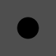 | |
| `cardinal swipe` | 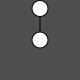 | |
| `cardinal swipe hold` | 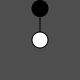 | |
| `diagonal swipe` | 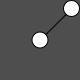 | |
| `diagonal swipe hold` | 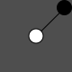 | |
| `return swipe` | 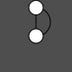 | |
| `corner swipe` | 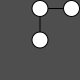 | |
| `diagonal return swipe` | 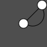 | |
| `diagonal corner swipe` | 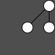 | |
| `return over swipe` | 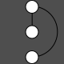 | |
| `diagonal return over swipe` | 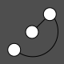 | |
